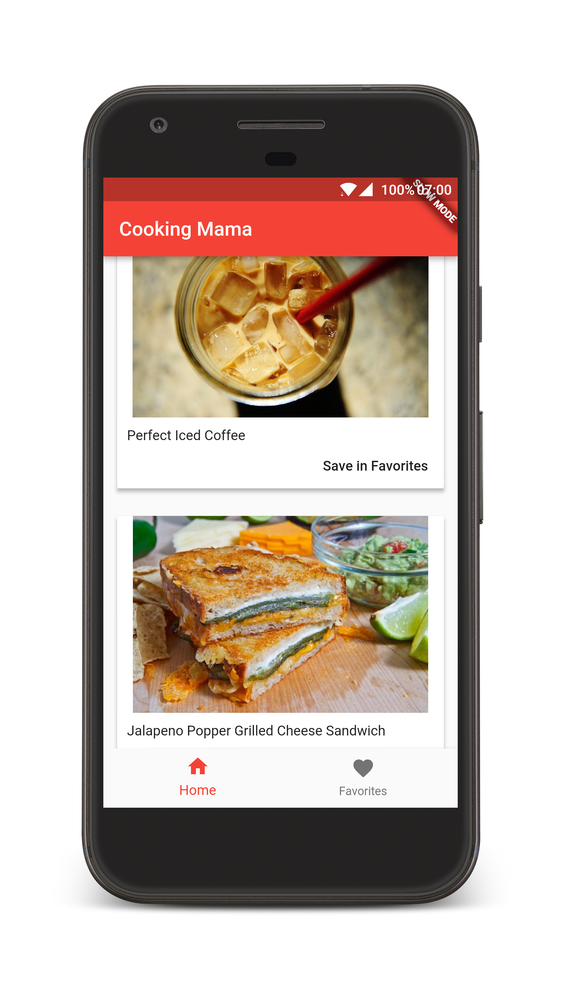

<p align="center">
    
    
</p>

<p align="center">
  <a href="#">
    
  </a>
  <a href="https://opensource.org/licenses/Apache-2.0" target="_blank">
    
  </a>
</p>

<p align="center">
Cooking Mama! (A Flutter app example for kitchens)
</p>

-------

This project a simple example about potential of Dart + Flutter for create mobile apps cross-platform with one code.

### How run the project

    **Important**: For the following code to run on Android, you'll need the latest version of the
    Google Play services APK installed on your Android testing device.

You need lastest version of Flutter installed in your system for build and run the project.

```shell
$ flutter run
```

License
-------

```
Copyright 2017 Oscar Caballero Pozas

Licensed under the Apache License, Version 2.0 (the "License");
you may not use this file except in compliance with the License.
You may obtain a copy of the License at

http://www.apache.org/licenses/LICENSE-2.0

Unless required by applicable law or agreed to in writing, software
distributed under the License is distributed on an "AS IS" BASIS,
WITHOUT WARRANTIES OR CONDITIONS OF ANY KIND, either express or implied.
See the License for the specific language governing permissions and
limitations under the License.
```

## Support on Beerpay
Hey dude! Help me out for a couple of :beers:!

[](https://beerpay.io/oscarcpozas/cooking-app-flutter)  [](https://beerpay.io/oscarcpozas/cooking-app-flutter?focus=wish)